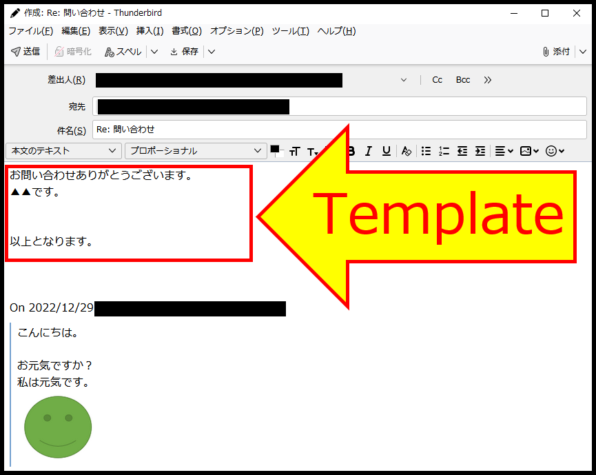
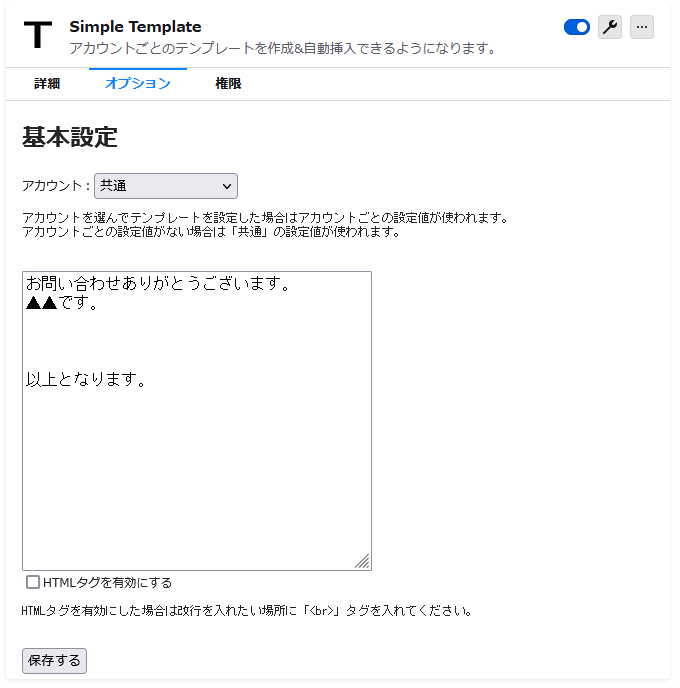

# thunderbird_addon_simple_template
Simple e-mail template addon for Thunderbird.

For each account, a template to be used in new messages or in replies can be set.

If the setting is not done for an individual account, a common template can be set.

Templates can be plain text or HTML.

## Localizations
 * Japanese
 * English
 * German

## Screenshots

## Motivation

Author Kimoto of Forest Software [stated](https://forest-soft.xyz/blog/detail?id=42) (translated):
> I was using an add-on called "SmartTemplate", which inserts a canned text like this,
> I used to use an add-on called "SmartTemplate" that inserted canned text like this, but it became unusable due to an upgrade of Thunderbird's add-on-related version.
>
> After that, I was using an add-on called "SmartTemplate4", which was created by another person,
> I had to purchase an annual license to use it, so I had to go back to typing canned text by hand.
>
> After waiting for a while, I couldn't find a good alternative, so I thought why not create one? So I decided to create an add-on.

## Links
 * [Simple-Template @ Thunderbird Add-Ons](https://addons.thunderbird.net/thunderbird/addon/simple-template/)
 * [Author's Homepage](https://forest-soft.xyz/blog/detail?id=42)
